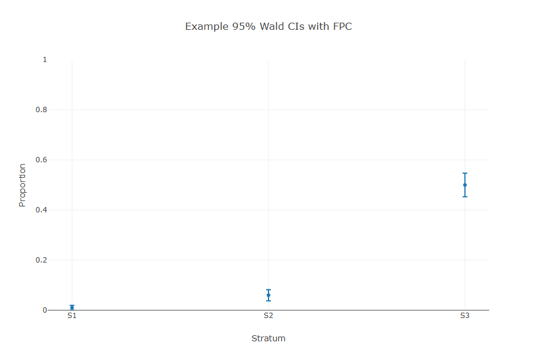

# OptiBin
[](https://github.com/grthomson/optibin/actions/workflows/ci.yml)

Efficient sample allocation and error estimation for **binary classification evaluation**.

This project demonstrates:

- **Optimal allocation** with stratum caps + iterative reallocation
- **Expansion estimator** of error proportions with finite population correction
- **Wald confidence intervals** for error rates
- **Automated visualisation** via Plotly + Puppeteer (static PNGs)

---

### Example: Confidence Intervals

The plot below shows 95% Wald confidence intervals for three strata with different error prevalences (and therefore variances):



---

## Getting started

### Clone and install:

```bash
git clone https://github.com/grthomson/optibin.git
cd optibin
npm install
```

### Run the test suite:

```npm test```

### Rebuild + export demo figures:

```
npm run build
node dist/examples/export_cis.js
```

Outputs will be written to the ```images/``` folder.

## Project Structure

```
optibin/
  src/         # core allocation/estimation code
  tests/       # vitest unit tests
  examples/    # demo scripts that generate plots
  images/      # exported static figures for README/docs
```

## Notes

OptiBin focuses on binary-outcome (proportion) evaluation with a clean-room TypeScript implementation. This was largely a self-learning project; the following alternative tools are likely to provide a better sollution that OptiBin.

- [optimall](https://cran.r-project.org/web/packages/optimall/index.html) (R)
Established R package for optimal allocation workflows (including Neyman-style allocation). If you work in R, it's a good cross-check for allocations and design decisions.

- [ssepy](https://github.com/amazon-science/ssepy) (Python)
Useful for sample size and proportion calculations.

These tools serve similar planning/estimation aims; OptiBin's value is offering a minimal, typed TS implementation that's easy to plug into web dashboards or CI pipelines, plus headless PNG exports for docs.

## CI

The GitHub Actions workflow runs on every push and pull request.  
It installs dependencies, type-checks the TypeScript, runs the Vitest unit tests, and builds the project on both **Linux** and **Windows** using Node.js 20.